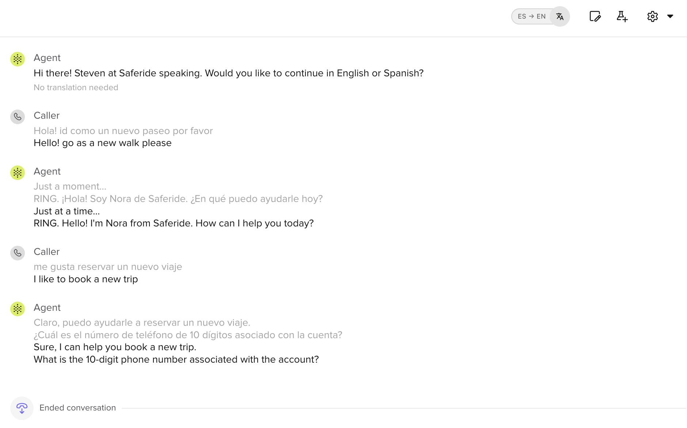
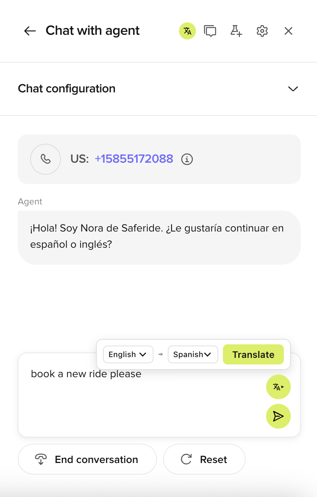
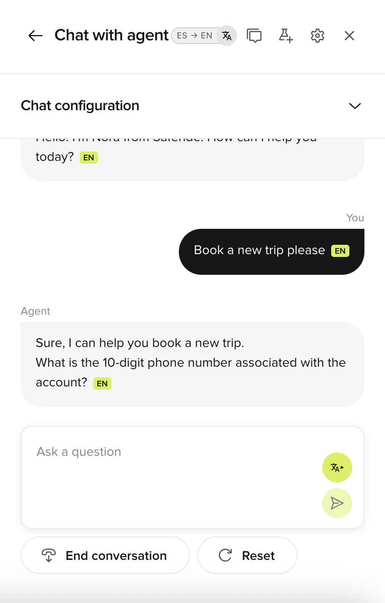
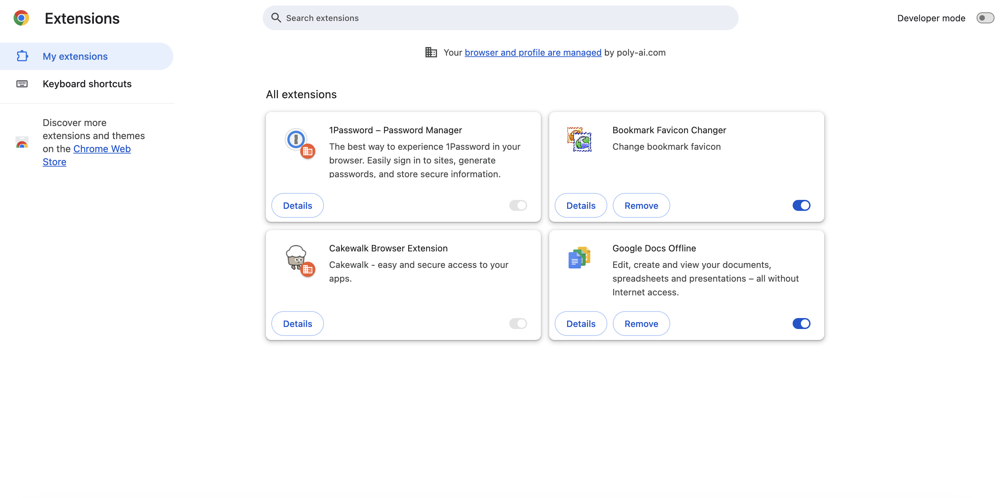
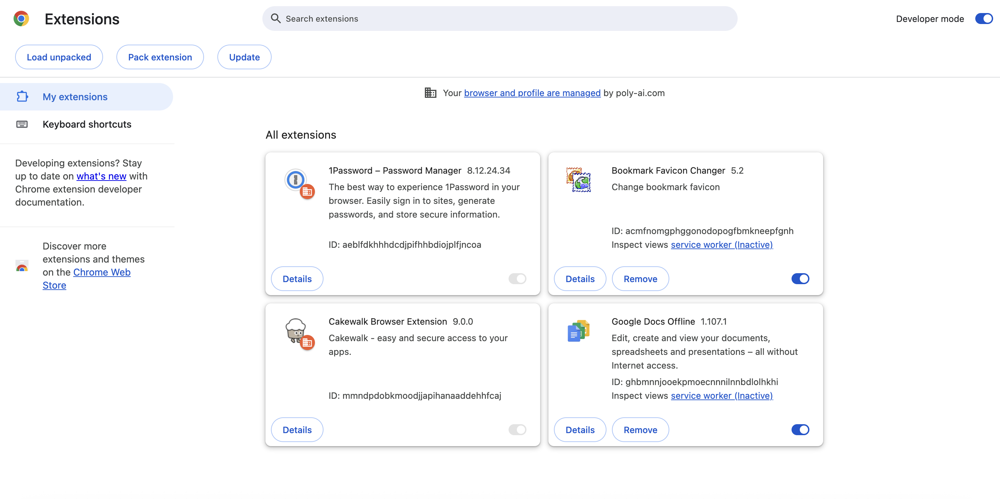
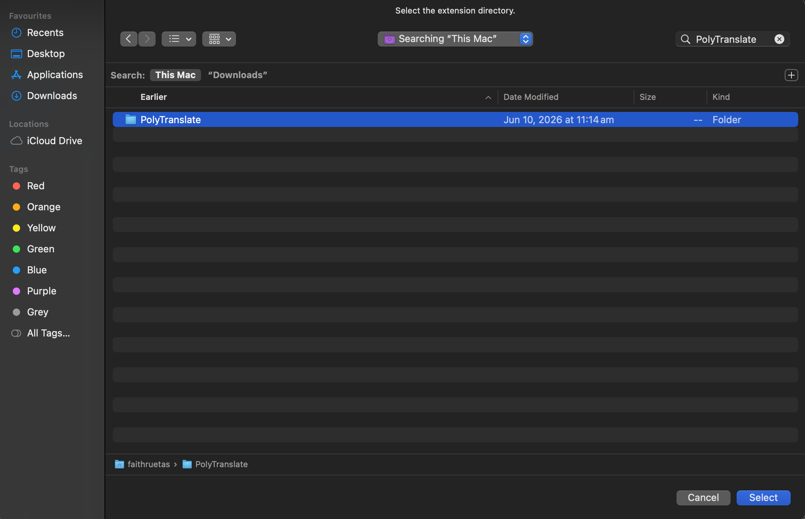
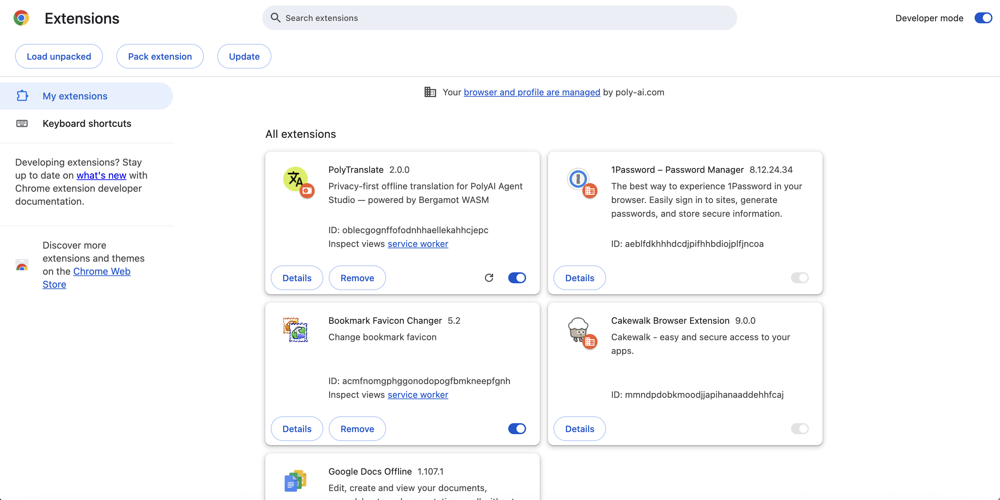

#  PolyTranslate

A privacy-first Chrome extension that adds offline, inline translation to PolyAI Agent Studio and Jupiter (`*.poly.ai` and `*.polyai.app`). All translation happens locally on your machine using [Bergamot](https://github.com/browsermt/bergamot-translator) — the same neural translation engine that powers Firefox Translate. No text ever leaves your device.

## Features

### Conversation Review Translation
Translate completed conversation transcripts with side-by-side original and translated text. Click the **PolyTranslate** button next to the Notes button in the call review panel. The button turns gray when translation is active, and the language pair label stays visible. Toggle off to restore originals.

> **Keyboard shortcut:** `Cmd+Shift+U` (Mac) / `Ctrl+Shift+U` (Windows/Linux)
>
> <p align="center">
>   
> </p>

### Test Chat Input Translation
A translate button sits above the send arrow in the chat text area. Click it to select source and target languages and translate your typed input before sending.

> **Keyboard shortcut:** `Cmd+Shift+Y` (Mac) / `Ctrl+Shift+Y` (Windows/Linux)
>
> <p align="center">
>   
> </p>

### Live Chat Translation
Translate incoming agent messages in real time during a chat session. Click the **PolyTranslate** button in the chat panel header (next to the review/settings icons). Translated messages show inline with a language badge (e.g. **EN**). The button turns gray while translation is active.

> **Keyboard shortcut:** `Cmd+Shift+U` (Mac) / `Ctrl+Shift+U` (Windows/Linux)
>
> <p align="center">
>   
> </p>

### Adaptive Extension Icon
The toolbar icon shows the full-color PolyTranslate logo on `*.poly.ai` and `*.polyai.app` pages and switches to a greyed-out version on all other sites.

## Privacy

PolyTranslate is designed so that **no translation data ever leaves your machine**:

- Translation runs entirely in-browser via a WebAssembly (WASM) build of [Bergamot Translator](https://github.com/browsermt/bergamot-translator)
- Language models are downloaded once during setup and stored locally in the `models/` directory
- After setup, the extension works fully offline — no network requests during translation
- The only network activity is the one-time model download during setup (`./setup.sh init`) or when adding languages

## Installation

### 1. Clone the repository

```bash
git clone https://github.com/PatrickSwanson-Poly/PolyTranslate.git
cd PolyTranslate
```

### 2. Download language models

Run the setup script to choose which languages you need. Each language pair is ~20-50 MB.

**macOS / Linux:**
```bash
./setup.sh init
```

**Windows (PowerShell):**
```powershell
.\setup.ps1 init
```

You'll see an interactive picker — enter the numbers of the languages you want, separated by spaces:

```
  Available languages:

    1) Arabic               9) Hebrew              17) Romanian
    2) Chinese             10) Hindi               18) Russian
    3) Croatian            11) Italian             19) Serbian
    4) Danish              12) Japanese            20) Spanish
    5) Dutch               13) Korean              21) Swedish
    6) French              14) Norwegian           22) Thai
    7) German              15) Polish              23) Ukrainian
    8) Greek               16) Portuguese          24) Vietnamese

  Enter numbers separated by spaces, all for everything, or q to cancel:
  > 6 7 20
```

This would install French, German, and Spanish. Type `all` to install every language (~1.5 GB), or `q` to cancel.

The setup script will offer to install the `polyt` shortcut (recommended) at the end of init. If you skip it, you can always run it later from the PolyTranslate directory:

**macOS / Linux:**
```bash
cd path/to/PolyTranslate
./setup.sh link
```

**Windows (PowerShell):**
```powershell
cd path\to\PolyTranslate
.\setup.ps1 link
```

On macOS/Linux this creates a symlink at `/usr/local/bin/polyt`. On Windows it creates a `polyt.cmd` wrapper. Either way, you can then run `polyt` from anywhere. Without the shortcut, you must run `./setup.sh` or `.\setup.ps1` from inside the PolyTranslate directory.

### 3. Load the extension

In a Google Chrome browser, navigate to `chrome://extensions` (paste this into the address bar).

<p align="center">
  
</p>

In the top-right corner, enable the **Developer mode** toggle

<p align="center">
  
</p>

Under the Chrome logo on the top left, click the **Load unpacked** button and select your local `PolyTranslate` folder

<p align="center">
  
</p>

Navigate to any Agent Studio page via [studio.us.poly.ai](https://studio.us.poly.ai/) or [jupiter.polyai.app](https://jupiter.polyai.app/). The PolyTranslate icons will appear when reviewing call transcripts and chatting with the agent!

<p align="center">
  
</p>

## Managing Languages

Use the `polyt` CLI (or `./setup.sh` on macOS/Linux, `.\setup.ps1` on Windows) to manage installed translation models:

| Command | Description |
|---------|-------------|
| `polyt init` | First-time setup — choose and download language models |
| `polyt add` | Download additional languages (also repairs incomplete installs) |
| `polyt update` | Re-download latest model versions for all installed languages |
| `polyt remove` | Remove installed language models to free disk space |
| `polyt status` | Show which models are installed and their sizes |
| `polyt pull` | Pull latest changes from git and open Chrome to reload |
| `polyt reset` | Hard reset — delete all models and config for a fresh start |
| `polyt link` | Create the `polyt` shortcut in `/usr/local/bin` |
| `polyt unlink` | Remove the `polyt` shortcut |

After adding or removing languages, reload the extension in `chrome://extensions` and refresh any open Agent Studio tabs.

> **Windows note:** `polyt pull` and `polyt reset` are not yet available in the PowerShell script (`setup.ps1`). Windows users can pull manually with `git pull` and reload at `chrome://extensions`.

### Supported Languages

Arabic, Chinese, Croatian , Danish, Dutch, English, French, German, Greek, Hebrew, Hindi, Italian, Japanese, Korean, Norwegian, Polish, Portuguese, Romanian, Russian, Serbian, Spanish, Swedish, Thai, Ukrainian, Vietnamese

### Download Sizes

| Tier | Languages | Size |
|------|-----------|------|
| Essential | es, fr, de, pt, it ↔ en | ~350 MB |
| All 25 languages | Full set ↔ en | ~1.5 GB |

## How It Works

### Translation Engine

PolyTranslate uses [Bergamot Translator](https://github.com/browsermt/bergamot-translator), a C++ neural machine translation engine compiled to WebAssembly. The WASM binary runs inside an [offscreen document](https://developer.chrome.com/docs/extensions/reference/api/offscreen) — an invisible extension page that handles all translation work without affecting page performance.

Translation models are provided by the [Mozilla Firefox Translations](https://github.com/mozilla/translations) project.

### English Pivot for Non-English Pairs

All models translate to or from English. For non-English pairs (e.g., Spanish → French), the extension automatically **pivots through English**: it translates Spanish → English, then English → French in a single operation using Bergamot's `translateViaPivoting` function.

This means:
- You need both language pairs installed (e.g., both Spanish and French)
- Quality is slightly lower than a direct model since it's two hops
- For transactional content like customer service transcripts, the pivot quality is solid
- Nuanced or idiomatic text may lose some subtlety through the pivot

### Architecture

```
Content Script (poly.ai / polyai.app page)
  ↓ chrome.runtime.sendMessage
Background Service Worker
  ↓ chrome.runtime.sendMessage
Offscreen Document
  → Bergamot WASM engine (local models, no network)
  ← translated text
```

## Updating

Run `polyt pull` to fetch the latest code and open Chrome's extensions page for a quick reload. Then:

1. Click the reload icon on the PolyTranslate card in `chrome://extensions`
2. Run `polyt update` if models have been refreshed upstream
3. **Refresh any open Agent Studio tabs** — required to avoid "Extension context invalidated" errors

## File Structure

```
PolyTranslate/
  manifest.json                  # Extension manifest (MV3)
  background.js                  # Service worker — icon switching + message routing
  config.js                      # Default language settings and language list
  translate.js                   # Thin messaging wrapper for translation requests
  content.js                     # Main content script (UI + all three features)
  offscreen.html                 # Offscreen document shell
  offscreen.js                   # Bergamot WASM engine + model loading
  model-registry.js              # Language pair → model file URL mapping
  styles.css                     # Injected styles for all UI components
  setup.sh                       # CLI for downloading/managing language models (macOS/Linux)
  setup.ps1                      # CLI for downloading/managing language models (Windows)
  installed-languages.json       # Auto-generated list of installed languages
  bergamot-translator-worker.js  # Bergamot Emscripten glue code
  bergamot-translator-worker.wasm # Bergamot WASM binary (~5 MB)
  models/                        # Downloaded language models (gitignored)
    es_en/                       # Spanish → English model files
    en_es/                       # English → Spanish model files
    ...
  icons/
    icon16.png / icon48.png / icon128.png       # Color icons
    icon16_bw.png / icon48_bw.png / icon128_bw.png  # Greyscale icons
```

## Troubleshooting

If the PolyTranslate icons turn **red**, the translation engine has encountered an error — usually because the extension's background process was suspended by Chrome. **Refresh the Agent Studio page** to restore it.

## Limitations

- **English pivot:** Non-English language pairs translate via English, which can reduce quality for idiomatic or nuanced text
- **No auto-detect:** Unlike the previous Google Translate version, Bergamot requires you to explicitly select both source and target languages
- **Model size:** Each language pair requires ~20-50 MB of disk space for model files
- **First load:** The WASM engine takes a few seconds to initialize on the first translation after loading the extension

## Authors

**Patrick Swanson** — PolyAI

**Faith Ruetas** — PolyAI
